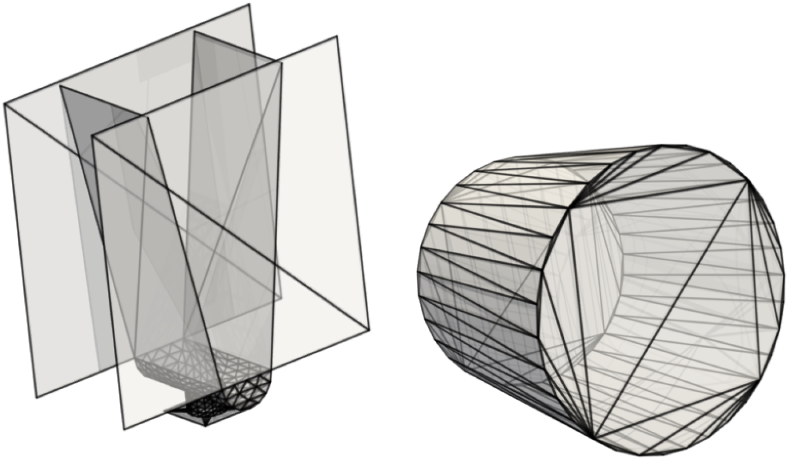
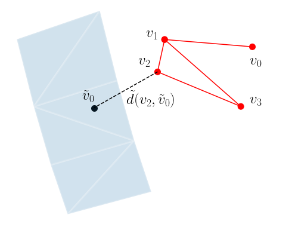
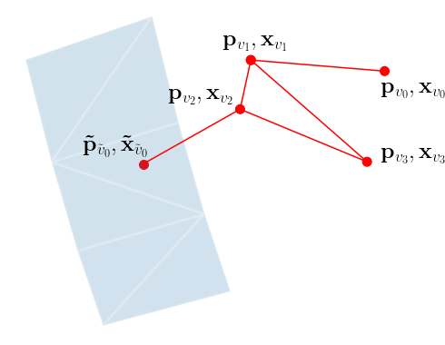

Blog post of the paper [Boundary Graph Neural Networks for 3D Simulations][arxiv-paper].

# Our aim

We want to learn complex 3D particle simulation trajectories from an initial state over many, many timesteps.
Seminal research on this topic was already carried out by [Sanchez-Gonzalez et al. [2020]][SanchezGonzalez2020]. They showed impressively how well particle simulation
trajectories can be learned by Graph Neural Networks (GNNs):

 
<iframe src="https://drive.google.com/file/d/1Udj80oklio3QIZGun2c8FSYU4hOZn0AV/preview" width="640" height="480"></iframe>

In this work we want to go one step further.
We aim to learn 3D simulations by Graph Neural Networks (GNNs) towards **industrially relevant setups**, such as hoppers and rotating drums.
This means we have to model complex geometric boundaries with triangularized surface areas.
However, such triangularized surface areas are notoriously difficult to model by machine learning approaches due to their heterogeneity with respect to size and orientation.

Exemplary setups from daily industrial use cases, hopper (left) and a rotating drum (right).

 

This task is far beyond trivial. The following examples show models for which **particle - particle** interactions are already learned pretty well as in the work of [Sanchez-Gonzalez et al. [2020]][SanchezGonzalez2020], but **particle - wall** interactions are not modeled correctly	:

 
 

# How do we learn simulations?

Our research is based on particle simulations from the particle simulator [LIGGGHTS][liggghts], which is based on the [Discrete Element Method (DEM)][DEM] and which is able to take complex mesh-based wall geometries into account.
We consider trajectories from this simulator as our **ground truth simulations**.

The core in learning to predict such simulations, is to accurately learn a **time-transition model**, which predicts from a previous state (or some previous states) the next state.
For this, we basically follow Sanchez-Gonzalez et al. [2020], i.e. our GNN predicts the **acceleration** of particles and semi-implicit Euler integration is used to obtain the next particle velocities and positions:

$$
\begin{align}
\dot{\boldsymbol{x}}^{t+1} &=\dot{\boldsymbol{x}}^{t}+\Delta t\; \ddot{\boldsymbol{x}}^{t} \\
\boldsymbol{x}^{t+1} &=\boldsymbol{x}^{t}+\Delta t\; \dot{\boldsymbol{x}}^{t+1} \,
\end{align}
$$

where $$\boldsymbol{x}$$ represents the position of a particle, $$\dot{\boldsymbol{x}}$$ represents the particle velocity and $$\ddot{\boldsymbol{x}}$$ represents the particle acceleration.

# Boundary Graph Neural Networks (BGNNs)

BGNNs extend traditional GNNs, such that the networks are capable of learning **particle - wall interactions** by dynamically inserting (virtual particle) nodes, if a particle is near a wall. Since we are focusing on the 3D domain, we do not sample all boundary surfaces and represent theses surfaces as static particles across the whole time. Instead  we insert additional nodes into the graph (representing virtual particles) if a boundary surface area is near a particle. Additionally, we enrich the feature space of GNN inputs in order to make e.g. wall **normal vector** information available for the graph network to learn a time transition model.
The images below visualize the basic idea of BGNNs (measuring distances between walls and particles, insertion of virtual particle for wall if distance is smaller than a threshold):

  
<table border="0" width="100%" cellspacing="0" cellpadding="0">
<tr class="hide_all">

<td width="50%">

 

</td>
<td width="50%">

 

</td>

</tr>
</table>

# Does it work?

We apply BGNNs to hoppers and rotating drums and use two different materials. For the **cohesive** material, there are large cohesive forces between the particles, while
for the **non-cohesive** material, we are not making use of these additional forces. An exemplary cohesive material could be asphalt in a paver, whereas an exemplary non-cohesive material could be gravel.
For both materials we do not assume additional cohesion between particles and walls.
Other than that there are (rolling) friction and restitution forces between particles themselves and between particles and walls.

## Models with a Cohesive Material

 

## Models with a Non-Cohesive Material

 

 
 

BGNNs have learned to accurately reproduce 3D granular flows over hundreds of thousands of simulation timesteps,
and most notably particles completely stay within the geometric objects without using handcrafted conditions or restrictions.

 

 

### Resources

[GitHub][GitHub] (not yet released)

### Correspondance

Blog post written by Andreas Mayr (mayr[at]ml.jku.at) and Johannes Brandstetter (brandstetter[at]ml.jku.at).

[arxiv-paper]: https://arxiv.org/abs/2106.11299
[SanchezGonzalez2020]: https://arxiv.org/abs/2002.09405
[liggghts]: https://doi.org/10.1504/PCFD.2012.047457
[DEM]: https://www.icevirtuallibrary.com/doi/pdf/10.1680/ege.35362.0025
[Eberly1999]: https://www.geometrictools.com/Documentation/DistancePoint3Triangle3.pdf
[GitHub]: https://github.com/ml-jku/bgnn/

{:refdef: style="text-align: center;"}

{: refdef}

